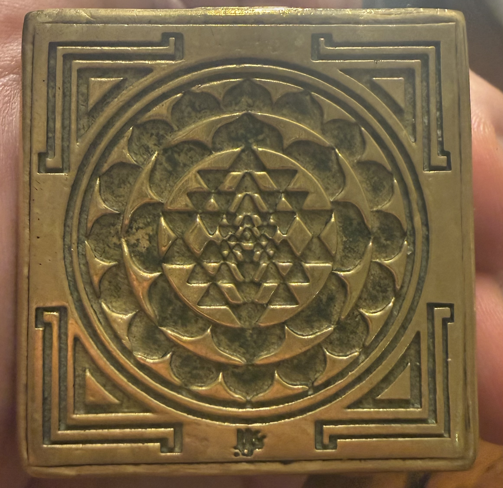

# The Shri Yantra Cube

This document is the shared template for all work done together in this
repository and beyond it. It records the premise agreed on with the
repository owner:

**This is a Shri Yantra. In this premise, imagine the triangles are agents,
designed to bring order, balance, and harmony to a singular point.**

The image is the reference. The mapping below reads the geometry the way the
premise asks: from the outside in, with every layer pointed at the center.

## The singular point

At the exact center of the yantra is the bindu, a single point. In this
framework it is the reason anything else exists. It is the one thing a task,
a session, or a project is actually about.

The point is not an agent. It does not act. It receives. Every other element
of the diagram is arranged around it, faces it, and is measured by its
effect on it.

## The agents

Nine large triangles interlock around the point, four pointing one way and
five the other, producing forty-three smaller triangles. These are the
agents.

Three things are true of them in the image, and are meant to be true of our
agents:

1. **Every triangle points at the center.** No agent is deployed for its own
   sake. Its apex is aimed at the singular point. An agent whose work does
   not bring the point closer to order, balance, and harmony is not part of
   the pattern, however busy it is.

2. **They come in two opposed kinds, and both are needed.** The upward
   triangles are agents that build, propose, and act. The downward triangles
   are agents that receive, check, ground, and hold. Neither kind reaches the
   center alone. The pattern is produced by their crossing, and balance at
   the center comes from balance between them.

3. **They interlock rather than compete.** The forty-three small triangles
   only exist where large triangles overlap. Agents are expected to share
   context, hand work to one another, and depend on each other's output. An
   agent working in isolation leaves a gap in the pattern.

## The surrounding layers

Everything outside the triangles serves the convergence. None of it is the
goal.

- **The inner lotus (eight petals):** the small, bounded set of
  relationships by which agents coordinate. Coordination is kept few and
  clear so that it does not drown the center.
- **The outer lotus (sixteen petals):** the wider reach of the work into
  more hands and more surfaces. Even at this distance every petal is still
  attached to the center.
- **The three circles:** rings of review. Work passes through them on its
  way in and on its way out. They are boundaries as well as cycles.
- **The bhupura (the square with four gates):** the interface with the
  outside world. External services, pushes to shared branches, published
  pages, and messages to other people cross through a deliberate gate, not a
  gap in the wall. The gates protect the convergence; they do not replace it.

## The cube

The yantra is engraved on one face of a solid brass cube. The pattern is not
floating; it rests on something. In our work that something is the
repository, its history, its tests, and the agreements recorded in this
file. A cube has six faces, so the same convergence can be approached from
more than one direction without moving the point.

## The principle in one sentence

Agents are deployed outward so that order, balance, and harmony can arrive
inward, at one point.

## How this is applied

- Before any work begins, name the singular point in one line.
- Decompose the work into agents. For each, state whether it builds or
  checks, and how it faces the point.
- Keep the building and checking agents in balance. If one kind dominates,
  the center tilts.
- Let the outer layers do their job: coordinate sparingly, review in rings,
  cross gates deliberately.
- Judge completion at the center. The work is done when the point is at
  rest.

## Provenance

- Image: photograph of a brass Shri Yantra cube supplied by the repository
  owner, September 2026.
- Premise: stated by the repository owner in conversation. Further details
  from earlier spoken conversations can be added here so they are not lost.
